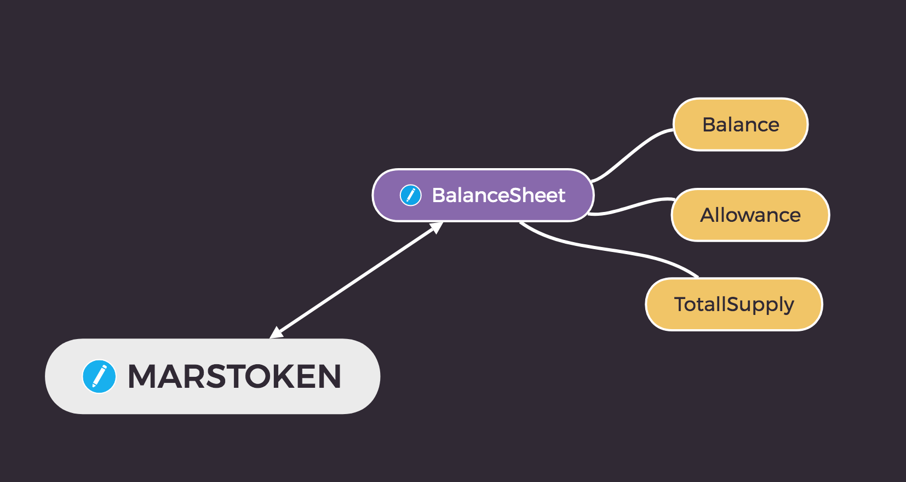

# Mars Token contracts

### Contract Reference:


* MarsToken as main contract are mintable & burnable ERC20 token.
* using external smart contract to store balance, allowance, totallsupply. that will be helpful during contract upgrade.

### Role:
* Owner
  * superAdmin of contracts
* MintMaster
  * mint management
* Mint
  * Can mint with allowance amount
  * Can burn token
* Blacklister
  * black list management

### About testing:
```
docker-compose up -d blockchain
./node_modules/.bin/truffle test
```

### Compilation

```
npm install -g truffle-flattener
truffle-flattener contracts/MarsTokenV2.sol > 1sgd.sol
```
